# MeTrEx - Membrane Trajectory Explorer
MeTrEx (**Me**mbrane **Tr**ajectory **Ex**plorer) is a Python program for visualising molecular simulation data from membranes interacting with small molecules (ligands). 

Its main feature is to show an overview of the molecules' course throughout the simulation with an abstract visualisation of the membrane. This overview of the data is shown on the 'main view', shown as soon as the data is loaded. Different analyses can be mapped onto the main view. These analyses can also be shown in plots below the main view in 'BottomViews'. Additionally, you can load other data files in 'SubView', shown in 'sub plots'.  Sliders and information panels give information about the currently shown frame. Exporting data is provided for image, CSV and XPDB files.

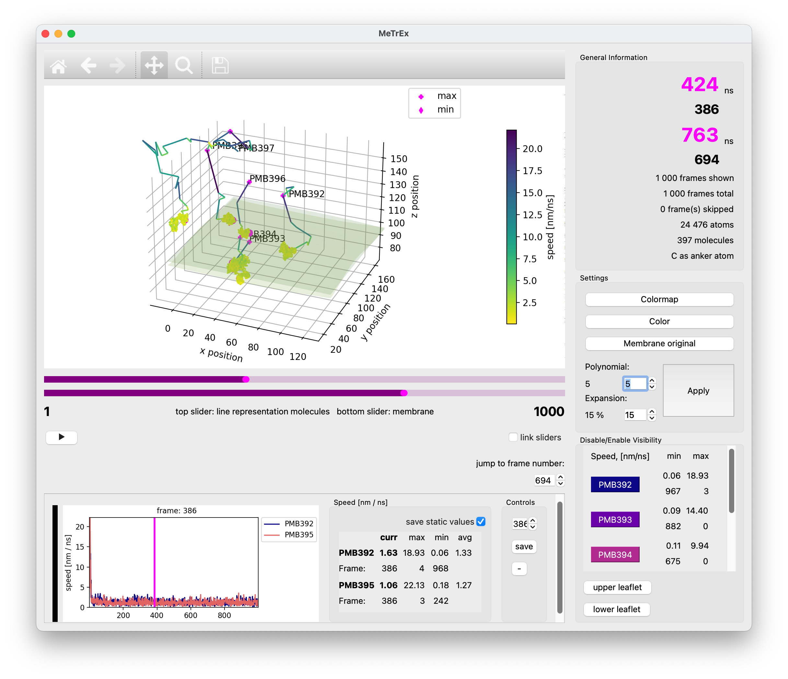

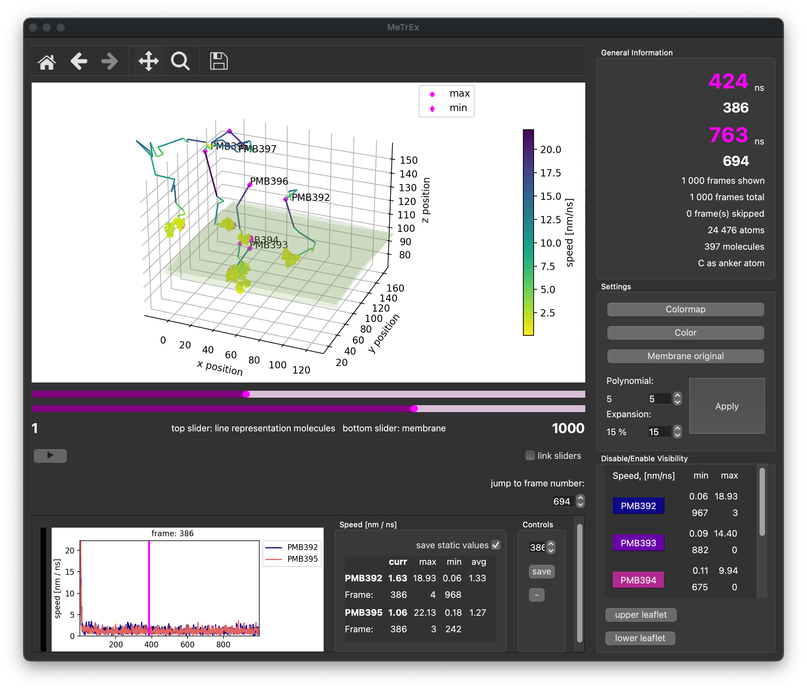

# Availability & Download
<!--
Download precompiled binaries for the most recent version of **MeTrEx**. 

See the [Installation](##-From-Source) section for instructions on the download and installation of **MeTrEx**

**MeTrEx** source code is (also) available from our [GitHub repository](https://github.com/sa-ja/MeTrEx). 
## Linux
[Download Linux](!)
## MacOS
[Download MacOS](!)
## Windows
[Download Windows](!)
# Installation
## Precompiled Package
Precompiled binaries are found in the [[#Availability & Download]] section.
 -->
## From Source
### Requirements
1. You need Python version 3.8 or higher 
2. You need [conda](https://conda.io/projects/conda/en/latest/user-guide/getting-started.html#managing-python) package manager installed on your system.
### Downloading and Installing MeTrEx
3. Clone the  [GitHub repository](https://github.com/sa-ja/MeTrEx): `git clone https://github.com/sa-ja/MeTrEx`
4. Build the environment:  
   	`cd MeTrEx && conda env create` (for MacOS and Windows)  
   	or  
	`cd MeTrEx && conda env create --file=metrex_linux.yml` (for Linux)  
5. Activate the environment: `conda activate MeTrEx`
### Run MeTrEx
6. Start MeTrEx from the console: `python MeTrEx/main.py`
# Manual
## Main Window
The application window of **MeTrEx** is made up of three parts ([see figure below](Pictures/MeTrExOverview.png))

1. The MainView
2. The information and interaction panel
3. The BottomView(s)

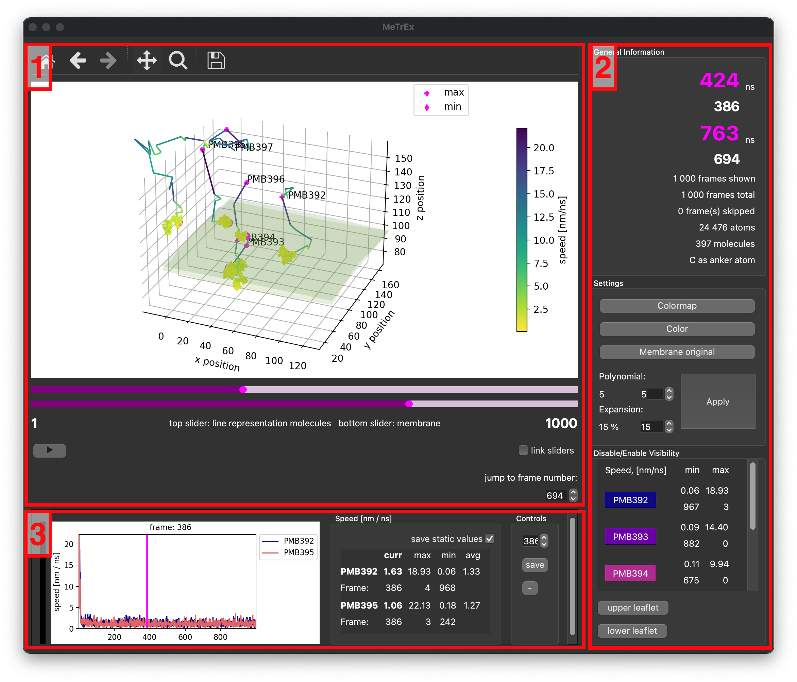

## Load Data
First, you must load two files to visualise and analyse MD data with **MeTrEx**. 

To do so, you can either navigate to *File* > *Open* in the menu bar or use the *ctrl+O* shortcut ([See picture](Pictures/OpenFile.png)).   
Then, you need to specify a topology file and a file containing simulation data ([See picture](Pictures/SelectFile.png)).   
Afterwards, another dialogue opens, allowing a data reduction by skipping every k-th frame or n frame at the beginning of the data ([See picture](Pictures/MeTrEx_ChooseSettings_S.png)).   
	k = Select every k-th frame to be shown    
	n = number of frames to skip at the beginning of the data   

You also need to specify the type of molecules represented by its trajectory line in  the line representation. The displayed names are the abbreviations for the molecule types used in the data file. Additionally, you can choose to manually select a proxy atom, which is used for the line representation. Otherwise, or in case of an error, `C` or `CA` are always used.

Once the molecules are chosen and, if applicable, the proxy atom is selected, the view is generated. 
This can take some time. A rough estimate will be displayed.

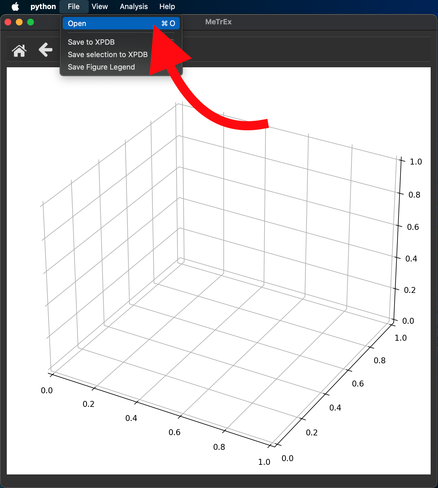
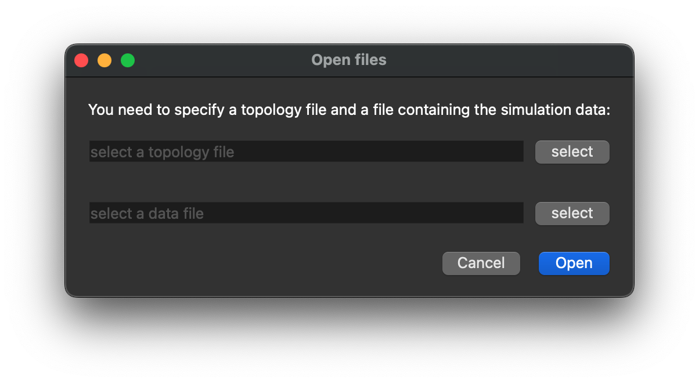
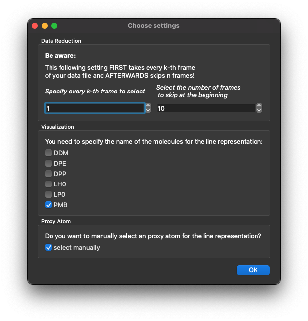

## Navigate in MainView
There are multiple ways one can interact with the main graph and navigate with it.

By clicking and holding the graph, you can rotate it freely.

On the top left of the MainView you can find the control panel with six button options. [See picture](Pictures/ControlPanel.png).
- The house button 🏠 is used to reset the main graph to its initial view
- The two arrow buttons ⬅️ ➡️ can be used to go back or forward to a previous view setting
- Once clicked, the cross-arrow button changes the function of clicking and holding the graph from rotating it to moving and positioning it along the x-, y— and z-axis. This is again deactivated when the cross-arrow button is clicked again, or the magnification glass button is selected.
- The magnification glass button 🔎 allows you, once selected, to zoom into the graph.
- The save button 💾 creates a .png file of the current view

Below the MainView graph are two sliders, which can be linked by the checkbox *link sliders*. These sliders allow you to change the graph to a different frame of your simulation data. 

The top slider changes the frame of the line representation molecules.
The bottom slider changes the frame of the membrane representation.

Pressing the play button ▶️ starts or stops a time laps of the represented data.

The 'jump to frame number' selector can be used to switch to a chosen frame.

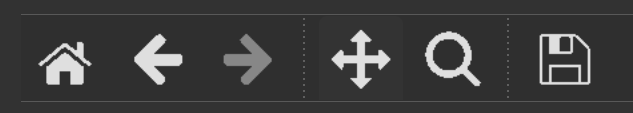

## Using the information and interaction panel 
The interaction panel consists of 3 panels: **General Information**, **Settings** and the molecule representation panel (**Disable/Enable Visibility**). [See picture](Pictures/interactionPanel.png).

Inside the **General Information panel** you find information for the position and exact simulation time of the current slider position/frame shown in the MainView.
Additional information about the simulation and representation is also displayed here.

The **Settings** panel offers a variety of options:
- `Colormap` allows you to change the colourmap used for the representation of all line representation molecules
- `Color` lets you pick a specific colour for each line representation molecule individually
- `Membrane original` lets you switch between a membrane abstraction and the original membrane representation
- `Polynomial` and `Expansion` let you choose the lipid surface regression values and recalculate the membrane abstraction. The polynomial can be modified in the range from 3 to 15, with membrane expansion from 5% to 30%. Once you set your values, press `Apply` to recalculate. Depending on the data and values, this can take some time to compute.

The molecule representation panel (**Disable/Enable Visibility**) depicts the individual molecules which were chosen for representation in [Load Data](#load-data), [See picture](Pictures/ControlPanel.png).    
If one of the three mapping methods of [Change View](#change-view) is chosen, the respective minimum and maximum are displayed next, together with the associated frame number.
By clicking the molecule name you can disable or enable individual molecule representations. 
The buttons `upper leaflet` and `lower leaflet` disable or enable the corresponding membrane representation.

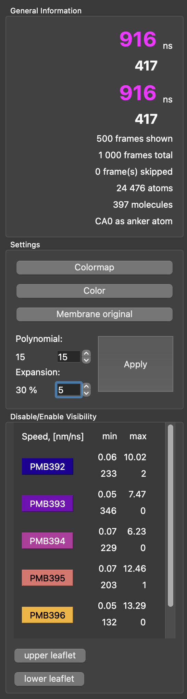

## Change View
Multiple options are available to modify and further analyse the data, such as changing the view and providing further graphs. All these options are in the menu bar under [`View`](Pictures/ChangeView.png).
### Modify the MainView
The following methods provide an overview of different mapping functions inside the MainView.
#### Select frame range
To select a specific range of frames go to *View* > *Select frames* and select a range of frames you want the data to be reduced to. If you want to return to the original MainView with all frames use *View* > *Reset*. 
#### Show frame position
If you want to see the chronological sequence of the trajectories indicated by a colour gradient, use *View* > *Map Position*. To reset the MainView to its original state, use *View* > *Reset*.
#### Show intramolecular distances
To visualise the changes in the intramolecular distance [Å] between exactly two different atoms of the representative molecules over time as a colour gradient, use *View* > *Map intramolecular distance*. A [dialog](Pictures/DistanceSelection.png) will appear, and you will have to select a pair of atoms for each representative molecule. Add the selection to the final selection by pressing `+` or remove an incorrect selection by pressing `-` to fix the incorrect entry. 
The molecule representation panel in the interaction panel will show the minimal and maximal intermolecular distance value as well as the corresponding frame number.
To reset the MainView to its original state use *View* > *Reset*. 
#### Show molecular speed 
To visualise the progression of the speed [nm/ns] of the representative molecules go to *View* > *Map Speed*. The speed progression is displayed as a colour gradient. 
The molecule representation panel in the interaction panel will show the minimal and maximal molecular speed value as well as the corresponding frame number.
To reset the MainView to its original state use *View* > *Reset*. 
#### Reset view
To reset the MainView to its original state use *View* > *Reset*. 
### Add and Modify BottomView
The BottomView provides a more in-depth analysis and visualisation of the mapping methods described in [Modify MainView](#modify-the-mainview).
Each BottomView panel has three areas, the graphical display, the statistical display and a control panel; [see picture (3)](#metrex-overview)
The control panel has the option to select a specific frame for this BottomView. To save the graph of the BottomView use the `save` button. When the check box in the statistical display is activated, a CSV file of the data shown in the overview is saved, too. Use the `-` button to remove this instance of the BottomView.
Additionally, in a single instance view, you can press `s/h` to show or hide minimum and maximum labels.
#### Show molecular speeds in BottomView
To show the progression of the speed [nm/ns] of the representative molecules or their single atoms in the BottomView you can go to *View* > *Show below* > *Speed* to display one instance in a single graph or *View* > *Show below* > *Multiple Speed* to display multiple instances in one graph.
#### Show molecular distances in BottomView
To show the changes in the intramolecular distance [Å] between exactly two different atoms of the representative molecules or all other molecules of the simulation in the BottomView, you can go to *View* > *Show below* > *Distance* to display one instance in a single graph or *View* > *Show below* > *Multiple Distance* to display multiple instances in one graph.
### Full-Screen Mode
To switch to full screen mode go to *View* > *Enter Full Screen* or use the shortcut `ctrl`+`F`.

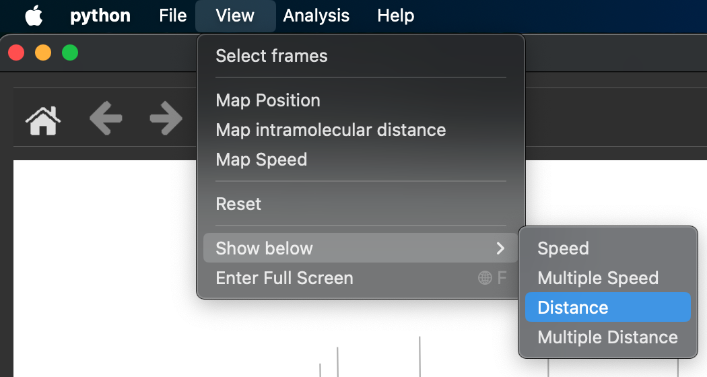
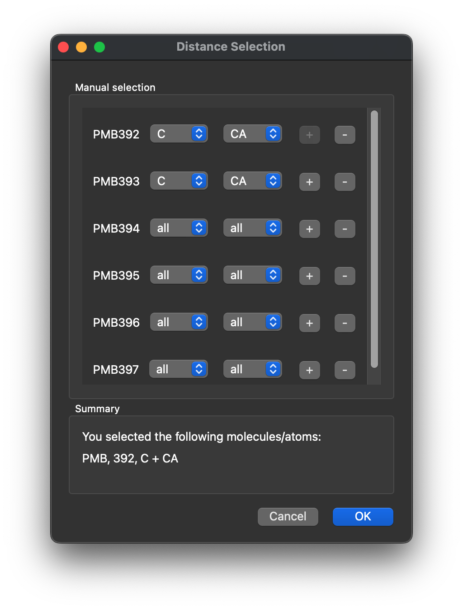

## Further Analysis 
To display data from an XVG file, go to *Analysis* > *Show XY-XVG file* ([see picture](Pictures/ShowAnalysis.png)). You need to provide a file and then select at least one representative molecule ([see picture](Pictures/XVGSelection.png)).    
An additional window will open ([see picture](Pictures/SubWindow.png)). You can use the slider to show the changes over the time scale or the `jump to frame number` to highlight a specific frame. Pressing the play button ▶️ starts or stops a time laps of the represented data.    
The sidebar options provide the option to change the colours of the graph, modify the legend, and hide the sphere, which indicates the currently selected frame. The `save` button will save the graph as a .png file.    

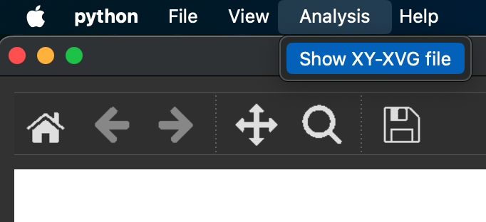
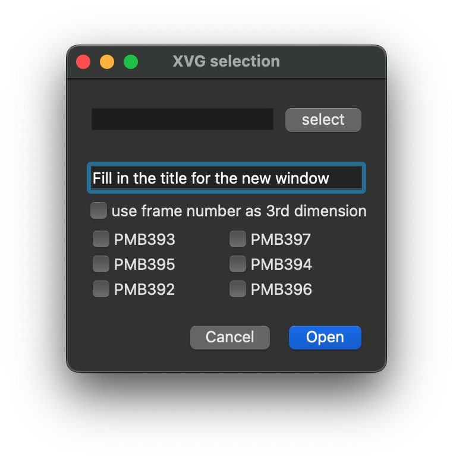
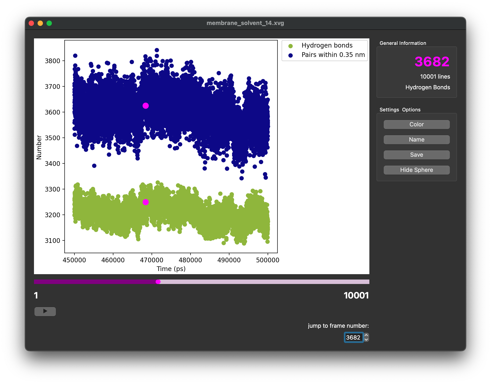

## Save File
There are different options to save your analysis or visualisations.
### Save PDB file
In the menubar, you can use *File* > *Save to XPDB* to save interesting structures as a PDB file. 
Use  *File* > *Save selection to XPDB* to save only selected molecules in a PDB file.
### Save image
If you want to save the view and all legends use the *save button* 💾 on top of the MainView as described in [Navigate in MainView](#navigate-in-mainview).    
To save only the legend of the MainView use *File* > *Save Figure Legend* ([see picture]((#metrex-vverview))).

To save the BottomView graph, use the `save` button on the right side of the graph. When the check box in the analysis-overview box is activated, a CSV file of the data shown in the overview is also saved.

When working in a separate analysis window, you can save the corresponding graphic with the `save` button on the right side of the additional window. 

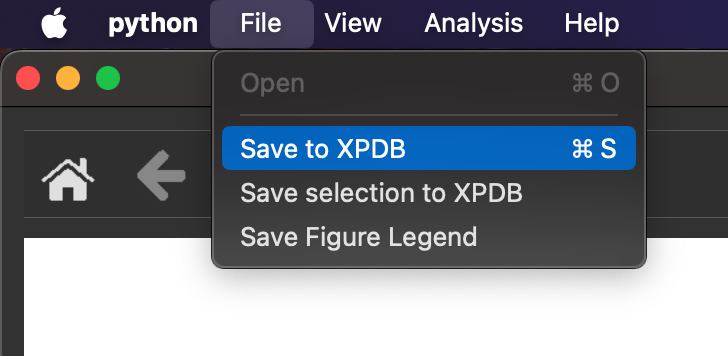

# License
MeTrEx is licensed under the [GPL3](https://www.gnu.org/licenses/gpl-3.0.en.html). 

MeTrEx is distributed in the hope that it will be useful, but WITHOUT ANY WARRANTY, without even the implied warranty of MERCHANTABILITY or FITNESS FOR A PARTICULAR PURPOSE. See the GNU General Public License for more details.

# Cite
Created by Christiane Rohse and Beat Ehrmann @AG Schreiber at University of Konstanz

When using MeTrEx, please cite:

xxx
